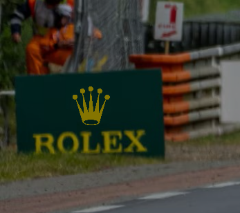
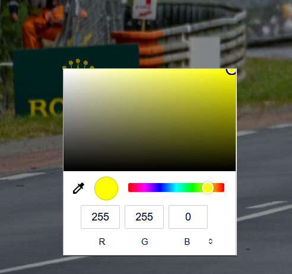
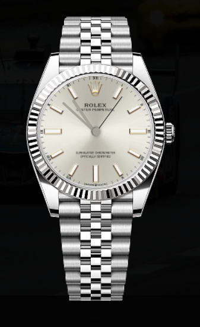

# 
Rolex Website Clone

Statična spletna stran, ki posnema uradno spletno stran Rolex, z integracijo treh različnih tipov logotipov (PNG, Bezier krivulja in SVG), vgrajenih neposredno v strukturo strani.

## Opis projekta

Projekt predstavlja front-end kopijo spletne strani Rolex, namenjeno učenju in demonstraciji spletnih tehnologij. Poseben poudarek je na prikazu in primerjavi različnih grafičnih formatov logotipov, ki so:

- **Prva stran** - Prva stran Rolex (ura)
- **Druga stran** - Druga stran rolex (le mans)
- **PNG logo** - Logo je v headerju
- **Bezier curve logo** - Bezier curve logo je na tabli od Rolexa
- **SVG logo** - V strani je na koncu

## Technologies Used

- **HTML5** – Struktura strani in vsebina
- **CSS3** – Oblikovanje in odzivno oblikovanje
- **JavaScript** – Funkcionalnost na strani odjemalca

## 🚀 Funkcionalnosti

- **Interaktivna analogna ura:** Realnočasovna ura s kazalci, ki se prikaže v prekrivnem oknu (overlay).
- **Dinamično risanje logotipa:** Rolex logotip je narisan na <canvas> z uporabo Bézierovih krivulj, kar omogoča gladke linije.
- **Color Picker:** Uporabnik lahko spreminja barvo logotipa (tako na platnu kot v SVG elementih v nogi strani) v realnem času.
- **Odzivno oblikovanje:** Video in slikovne vsebine so prilagojene različnim velikostim zaslonov.
- **Večstranska navigacija:** Ločeni strani za domov (index.html) in posebno Le Mans sekcijo (index2.html).

### Bombonček
 
- Na levem krogu logota se nahaja menjava barve
  
- Na desnem krogu logota se nahaja ura ki prikazuje realen čas  
   
  
## License

This project includes a AGPL-3.0 license

## Note

This is a front-end clone for educational/demonstration purposes only and is not affiliated with Rolex Inc. All Rolex trademarks and logos are property of their respective owners.
